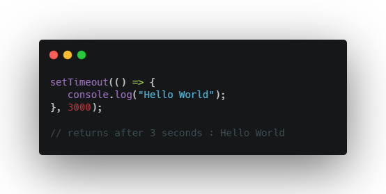
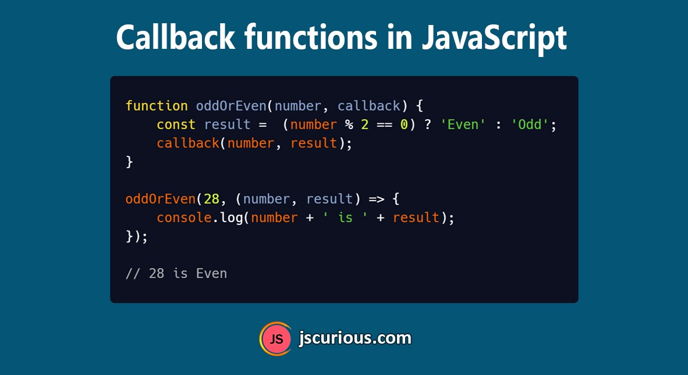

# Synchronous


## Synchronous code runs in sequence. This means that each operation must wait for the previous one to complete before executing.

# Asynchronous
## Asynchronous code runs in parallel. This means that an operation can occur while another one is still being processed.

# setTimeout()
## The setTimeout() method executes a block of code after the specified time. The method executes the code only once.
## The commonly used syntax of JavaScript setTimeout is:
## Its parameters are: 
- ### function - a function containes block of code
- ### milliseconds - the time after which code executes
## The setTimeout() method returns an intervalID, which is a positive integer.


# Callback()
## A function is a block of code that performs when we call it. 
## In JavaScript, you can also pass a function as an argument to a function. This function that is passed as an argument inside of another function is called a callback function.

# Promise
## The way to handle asynchronous operation, we can understand that the operation successfully completed or not.
## It has three states :
- ## fullfilled
- ## Rejected
- ## Pending
## A promise starts with pending. It explain that the program is loading and after this period it can be fullfilled that means accepted or rejected.


# To Create a promise object, we use Promise() constructor.
```JS
    let promise = new Promise(function(resolve, reject){
        // ..... do some thing
    }); 
```
# Try/catch/finally
## The try, catch and finally blocks are used to handle exceptions (a type of an error). Before you learn about them, you need to know about the types of errors in programming.
# Async await
## We use the async keyword with a function to represent that the function is an asynchronous function. The async function returns a promise.
## The await keyword is used inside the async function to wait for the asynchronous operation.
```JS
    let promise = new Promise(function(resolve, reject){
        setTimeout(function(){
            resolve("Promise resolved")},4000);
    })
    async function asyncFunc(){
        let result = await promise;
        console.log(result)
        console.log("Hello")
    }
    asyncFunc();
```
# Request
## API - Application Programming Interface
## What is difference between API and REST API?
### API -  Application Programming Interface
### Rest API - It is a special API, named REST, explains interaction with Web Services
# Rest API
## Fetch()
## Fetch API предоставляет интерфейс JavaScript для работы с запросами и ответами HTTP. Он также предоставляет глобальный метод fetch() (en-US)который позволяет легко и логично получать ресурсы по сети асинхрониний
## GET
```JS
    const getUser = async()=>{
        try{
            const response = await fetch("")
            const data = await response.json()
            console.log(data)    
        }
        catch(error){
            console.log(error)
        }
    }
```
## POST
```JS
    const getUser = async(user)=>{
        try{
            const response = await fetch("...",{
                method :"POST",
                headers : {
                    Accept:"application/json"
                    "Content-Type":"application/json",
                },
                body.JSON.stringify(user)
            });    
        }
        catch(error){
            console.log(error)
        }
    }
```
## PUT
```JS
    const getUser = async(id, edituser)=>{
        try{
            const response = await fetch("...", {
                method :"POST",
                headers : {
                    Accept:"application/json"
                    "Content-Type":"application/json",
                },
                body.JSON.stringify(edituser)
            })
        }
        catch(error){
            console.log(error)
        }
    }
```
## DELETE
```JS
    const getUser = async()=>{
        try{
            const response = await fetch("...",{
                method:"DELETE",
            }) ;
        }
        catch(error){
            console.log(error)
        }
    }
```
# Axios
## Axios - это HTTP-клиент, основанный на Promise для node.js и браузера.Он может работать в браузере и node.js с той же базой кодов
```JS
<script src="https://cdn.jsdelivr.net/npm/axios/dist/axios.min.js"></script>
```
## GET
```JS
    const  postCreate = async()=>{
        try{
            const{data} = await axios.get("url")    
        }
        catch(error){
            console.log(error)
        }
    }
```
## POST
```JS
    const  postCreate = async(editUser)=>{
        try{
            const{data} = await axios.get("url", editUser)    
        }
        catch(error){
            console.log(error)
        }
    }
```
## PUT
```JS
    const  postCreate = async(id, editUser)=>{
        try{
            const{data} = await axios.put(`url/${id}`, editUser)    
        }
        catch(error){
            console.log(error)
    }
    }
```
## DELETE
```JS
    const  postCreate = async()=>{
        try{
            const{data} = await axios.delete(`url/${id}`)    
        }
        catch(error){
            console.log(error)
        }
    }
```